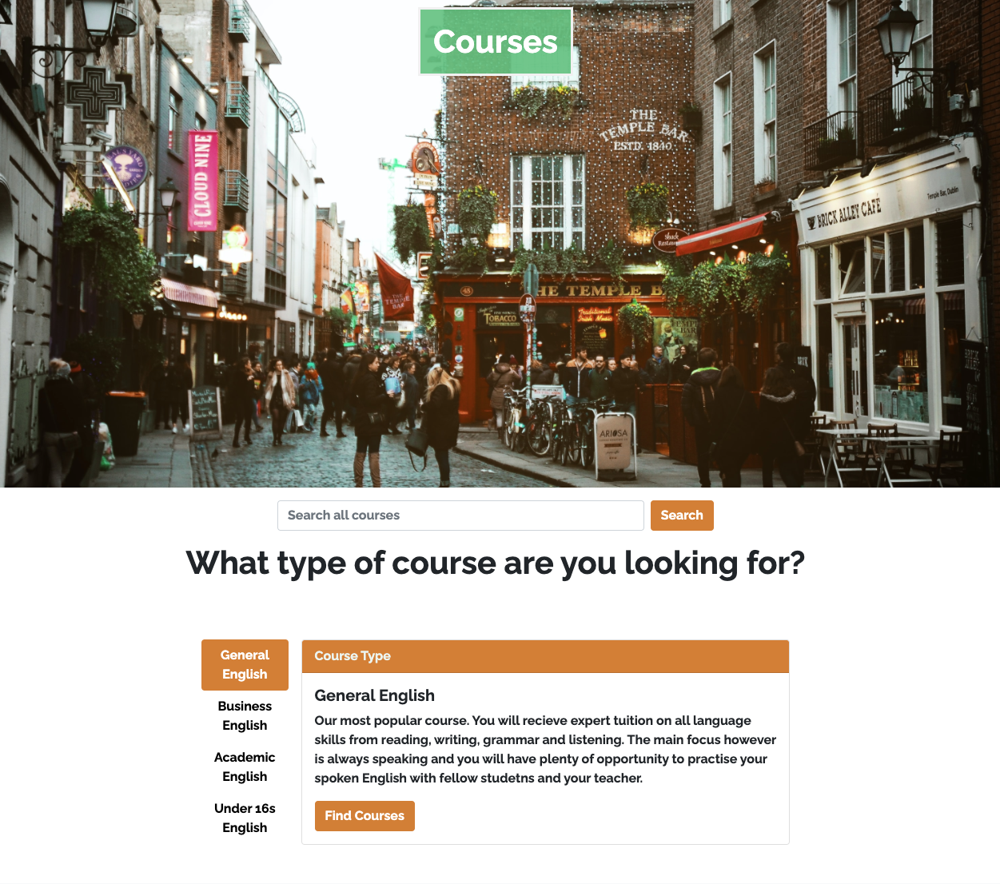
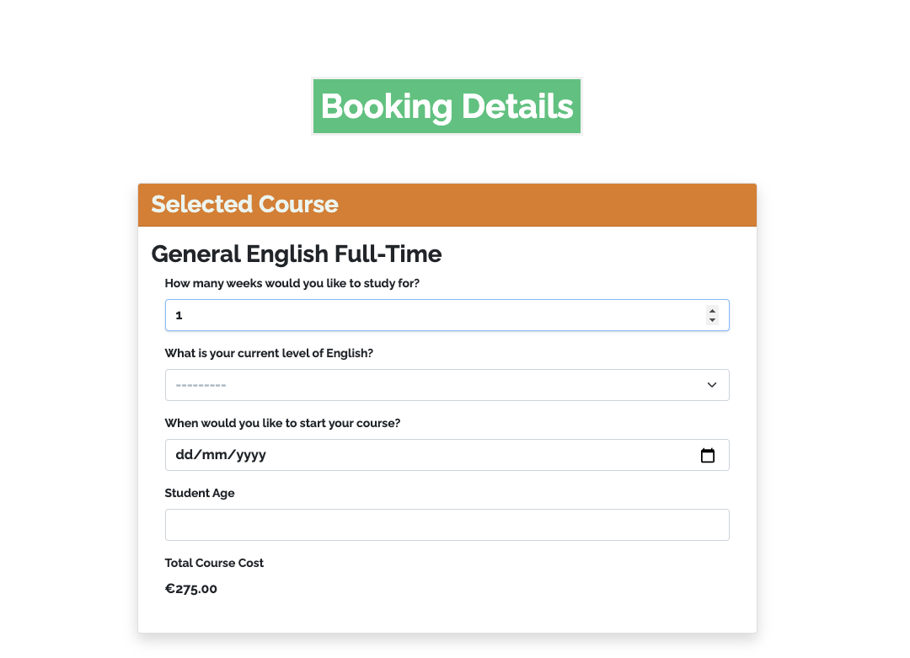
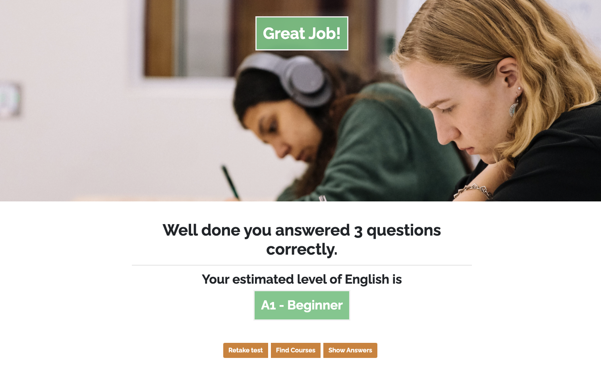

# Milestone Project 4 – Language School Website

# **Temple Bar School of English Website**


***A note for site users***

I have included the admin login details in the comments section when submitting the project as instructed by the Code Institue Assessment Handbook.

This website is for educational purposes and the stripe functionality is set up to accept test card details. 
**DO NOT USE YOUR REAL CARD DETAILS.**

To use the Stripe functionality please use the following details.

* Card number : 4242 4242 4242 4242
* Any date
* Any CVV number.
* Any 5 digit Zip Code

# **Table of Contents**

- [**UX**](#ux)
  * [**Project Goals**](#project-goals)
  * [**Users**](#users)
  * [**User Story**](#user-story)
- [**Wireframes**](#wireframes)
- [**Design Choices**](#design-choices)
- [**Features**](#features)
  * [**On Every Page**](#on-every-page)
  * [**Homepage**](#homepage)
- [**Courses**](#courses)
- [**Information Architecture**](#information-architecture)
- [**Technologies Used**](#technologies-used)
  * [**Languages Used**](#languages-used)
- [**Frameworks, Libraries & Programs Used**](#frameworks--libraries---programs-used)
- [**Testing**](#testing)
- [**Deployment**](#deployment-)
- [**How to deploy this project to Heroku**](#how-to-deploy-this-project-to-heroku)
- [**Gunicorn**](#gunicorn)
- [**Procfile and final Heroku steps**](#procfile-and-final-heroku-steps)
- [**Amazon AWS**](#amazon-aws)
- [**How to run this project locally**](#how-to-run-this-project-locally)
- [**Credits & Content**](#credits---content)
  * [**Code**](#code)
  * [**Acknowledgements**](#acknowledgements)

<small><i><a href='http://ecotrust-canada.github.io/markdown-toc/'>Table of contents generated with markdown-toc</a></i></small>


## **UX**

### **Project Goals**

 The primary goal of this project is to build a full-stack web application for a fictional English language school in Dublin that offers prospective English students in Dublin the chance to discover what courses the school offers, and how those courses could match their English language learning expectations or goals. The site offers e-commerce functionality via Stripe, a blog section and interactive English level test as well full CRUD functionality for admin users to update courses, blog posts and user profiles. 

### **Users**

The central audience for this site are English language learners, or the parents of young English language learners, who would like to study in Dublin. 


### **User Story**

| User Story ID | As a/an                                                                          | I want to be able to ...                                                       | So that I can ...                                                     |
|---------------|----------------------------------------------------------------------------------|--------------------------------------------------------------------------------|-----------------------------------------------------------------------|
| 1             | Student interested in learning English in Dublin                                 | Find out what type of courses the school offers                                | See if they are suitable for me                                       |
| 2             | Student interested in learning English in Dublin                                 | Find out the times and costs of each course                                    | See if they are suitable for me                                       |
| 3             | Student interested in learning English in Dublin                                 | Hear from previous students about their experience at the school and in Dublin | Judge if I am likely to have a similar experience                    |
| 4             | Student interested in learning English in Dublin                                 | Find out about the teachers and their style of teaching                        | See if their teaching style matches my learning goals and preferences |
| 5             | Student interested in learning English in Dublin                                 | Find out which course would suit my current level of English best              | Ensure that I study at an appropriate level                           |
| 6             | Student who wants to book an English course at Temple Bar School of English      | Find the course I want to book easily                                          | Save time and not book the wrong type of course                       |
| 7             | Student who wants to book an English course at Temple Bar School of English      | Find as much details as possible about the course                              | Be sure that the course I'm booking is right for me                   |
| 8             | Student who wants to book an English course at Temple Bar School of English      | Pay for the course securely                                                    | Have peace of mind that my money is being spent safely                |
| 9             | Student who has already booked an English course at Temple Bar School of English | Check information about which course I have purchased                          | Double check any information after the booking process has finished   |
| 10            | Student who has an account with the site                                         | Read interesting articles about learning English and the school itself.        | Prepare for my course or simply improve my knowledge of English       |
| 11            | Business / Site Owner                                                            | Have admin privileges                                                          | Ensure that the site is run correctly                                 |
| 11            | Business / Site Owner                                                            | Add and update course details.                                                 | Change or update course details such as prices or course lengths      |
| 11            | Business / Site Owner                                                            | Delete courses                                                                 | Remove unpopular courses or seasonal ones.                            |
| 11            | Business / Site Owner                                                            | Update and edit the website's blog with articles                               | Keep site visitors engaged and promote the school's teaching methods  |

## **Wireframes**

[Wireframes](media/readme_images/Wireframes.pdf)

## **Design Choices**

    
**Font**

There is only one font used throughout the website, which is Raleway sans-serif. I chose this font for not only its elegance and clarity but it's readability. This site's main users will not be native speakers and may find reading in English challenging. Therefore I chose to use only one font throughout the site so as to not clutter the pages with contrasting styles. 

**Colours**

The color palette was chosen to maximise the white space of the site and let images stand out, whilst also reinforcing that this is English Language school in Ireland with the green and orange of the highlighting colours suggesting the Irish flag. 

## **Features**

### **On Every Page**

**Navigation**

On every page there is a standard, collapsible nav bar built using Bootstrap 5 classes that shows the website’s name and brand in the top left. There are links for the homepage, a dropdown menu for the course library offering options for General English, Business, Academic and Under 16s courses with an option to view all courses as week. The next link is for the site's Level Test and the fourth nav-link is for the site's blog. On the right are options to log in / register. If a user is logged in then the login and register links are replaced with User profile and log out links.


**Footer**

The footer includes social media links to the site's social media pages. Additional links to the separate course categories and blog and level test as well as contact information for the school. 


### **Homepage**

**Banner-Image**

The homepage banner image is an image of the Temple Bar area of Dublin where the fictional school is located. The image was chosen as it is a good representation of the lively area and includes the name Temple Bar written clearly on one of the budlings. The name of the school is displayed on a green background and is animated to enter the site from the left

**Animated Homepage Headings and call to action button**

Below the image is a white band with four lines of black text and a call to action button . 'Learn English in the heart of Dublin' is the main heading. The secondary headings reads 'Courses to suit all levels', 'Fun and Engaging Teachers' and 'Reach your English goals'. The call to action button reads 'Find Courses' and will take a user to the course library section of the site. All of the headings are animated with the main heading entering from the left of the screen and the three sub-headings from the bottom to add a little dynamism to the homepage.


**Why study with us section**

A green band with white text asks the question 'Why study at Temple Bar School of English?' and below it are three large font-awesome icons representing the three main reasons why students should study at the school, teaching, facilities and experience.


**Course Cards**

The four category of courses that the school offers are each given a card with a matching image and a short description of the content of each course. At the foot of each card is a link taking the user to the specific course library for that category so the user does not have to manually search for a course. 


**Student Testimonials**

A green background banner with three cards centre aligned showing a former student of the school and a quote about their time at the school so users can learn a little more about what the school offers. 


## **Courses**

The courses page can be navigated to from the navbar, the individual course card or the call to action button on the homepage. There are two possible views that a user can see. 

**All Courses**

The all courses view has a heading with the question 'What type of course are you looking for?" and a vertical pills nav section with an accompanying card with information about each course category. If a user clicks on the find course button for a category they will be taken to the course library view as shown below. The user also has the option to search for a term in the search bar above the course category navigation which will return the course library view showing only courses which include the search term. 



The course library view includes the search bar for any further search terms the user might want to use. Below the search box the user will be shown the course detail cards giving the user all the information they need about each course in a particular category or matching a search term. 


**Booking Form**

Once a course has been selected the user is taken to the booking form page. At the top of the page is a card containing the course details form. 

The user selects :
* the desired length of the course in weeks, as they increase or decrease the amount of weeks the total course cost at the bottom of the card should automatically update.
* the level of the course from the select input
* the date they would like to start their course on from the datepicker
* their age

Below the card is the student details form into which the user inputs their:
*  full name
*  email address
*  phone number
*  country of residence
*  nationality
*  first language

The user can then proceed to the payment screen via the 'Proceed to Payment' Button or go back the courses page.




*** Checkout ***
The checkout page has a booking summary car at the top recapping all the details the user has just entered on the booking form page. B

After confirming these details are correct the user can then add billing information, (the full name and country from the previous page will be auto added) and add their card number , cvc and zip code to confirm payment.


***Checkout Success***

Once payment is completed the user will see the checkout success page which contains the users booking number , course start date and links to the blog and level test in order for them to continue to explore the site. 


**Level Test**

The Level test can be reached by the link in the nav bar and through the homepage as well as the checkout success view. The test is a series of 20 multiple choice questions which increase in difficulty, designed to assess a student's approximate level of English.

The test begins when a student selects the first answer. They are given feedback by the a success message if they are correct or an error message toast in red.  After the 20th question has been answered a result page will appear informing the student how many questions they answered correctly and their approximate level of English with a button that links the user to the courses section in which they can find a course to suit their level. The user can also click on the show correct answers button to view all test questions again with the correct answer highlighted. 





**Blog**

The blog section of the site is designed to provide prospective and existing students an opportunity to read articles written by the school's teachers. In order to encourage new users to register for an account to the site the articles can only be read by logged in users.

The blog articles are listed below the banner image with a title a short description of the post and information regarding the post author and date posted. 

When a site user clicks on the blog preview text, if they are not logged in they will be redirected to the login page as the post details view is restricted to logged in users only. 

Once logged in the full blog post can be read and there is a like button for users to like interesting articles. 

Admin users will find an add post button at the bottom of the page from which they can access the upload add post form in order to add a new post to the site. 

Admin users can also edit a post and delete a post from the blog post page via the two buttons found at the bottom of the post. 


**Log In / Register Forms**

The site utilises the Django Allauth forms to carry out all login and authentication processes. The built in allauth forms have been appropriately styled , placed beneath the site's banner image styled into a Bootstrap card layout matching the sites colour scheme.


**User Profile**
Once a user is logged in the can visit the user profile section via the link in the navbar. On this page there are two columns on the left there is a form in which the users can upload and update their  full name, email, phone number, country of residence, nationality, and first language. On the right hand column (or below on mobile) there are details about any bookings the user has made. The user will be able to see a booking number and the date booked and by clicking the more details button the user will see the course dates, course level, start date and timetable. 


**Messages**

All django messages are presented throughout the site via Bootstrap Toasts that appear on the top right of the screen just below the navbar.
Each toast has a header colour matching the type of message with bootstrap's built in colour classes, success, danger, info, warning. 


**Custom Error Pages**

All 404, 403 and 500 errors will trigger the custom error pages with the main banner and a card message detailing the error and a link to return to the homepage.


**Admin Procedures**

For admin users who are logged in the course management navlink will become available from which the user can access the add course form in order to add a new course to the course model.

Admin users also have the option to edit course details or delete a course entirely for the course library page by clicking on the edit course or delete course buttons found next to the book course button on course detail card. 


## **Information Architecture**

**Database Models and Schema**

During the production of the site a sqlite3 database was used to store data , however after deploying to Heroku to serve the final version of the site a PostGres database has been used with the following models.

***Models***
* User
From Django Allauth containing the username, email, and password.

* User Profiles
Containing any information on past bookings and personal details

* Course Categories
Containing the four categories of course the school offers.

* Courses
Containing information regarding individual courses that belong to the four course categories

* Booking
Containing all details related to an individual course booking

* Level Test
Containing the questions, options and correct answers for the interactive level test

* Blog
Containing the titles content and author details of individual blog posts written for the site.

The full models and their relationship to each other are outlined in the schema below. 


## **Technologies Used**

### **Languages Used**
* [HTML5](https://html.com/html5/)
* [CSS3](https://www.w3.org/Style/CSS/Overview.en.html)
* [Javascript](https://www.javascript.com/)
* [Python](https://www.python.org)

## **Frameworks, Libraries & Programs Used**

* [Django](https://www.djangoproject.com/)
    * Django was used to create the project
* [Django Allauth](https://django-allauth.readthedocs.io/en/latest/installation.html)
    * Django Allauth was used to create user log in functionality to the site

* [Django Countries](https://pypi.org/project/django-countries/)
    * Django countries was used to populate the options for the country select input in forms throughout the site

* [Django Crispy Forms](https://django-crispy-forms.readthedocs.io/en/latest/)    
    * Django Crispy Forms used to style form inputs throughout the site 

* [Stripe](https://stripe.com/en-ie)
    *  Stripe has been used for the payment section of the site.    

* [Bootstrap 5](https://getbootstrap.com/)
    * Imported CSS and JS, utilised grid system, navbar, form control and modals.

* [Google Fonts](https://fonts.google.com/)
    * Google fonts were used to import the font into the style.css file which is used on all pages throughout the project.

* [Git](https://git-scm.com/)
    * Git was used for version control by utilizing VSCode to commit to Git and Push to GitHub.

* [Github](https://github.com/)
    * GitHub was used to store the projects code after being pushed from Git.

* [Gitpod](https://gitpod.io/)
    * Code was written and edited using the gitpod extension in chrome. 

* [Balsamiq](https://balsamiq.com/)
    * Balsamiq was used to create the wireframes during the design process.

* [JSLint](https://www.jslint.com/)   
    * Used to validate Javascript code.

* [Prettier](https://prettier.io/)    
    * Used to format HTML,CSS and Javascript code.

* [Am I Responsive](http://ami.responsivedesign.is/) 
    * Used to create images of the website on different screen sizes for the documentation. 

* [JQuery](https://jquery.com) 
    * Used to implement the Owl Carousel feaututes.

* [FontAwesome](https://www.bootstrapcdn.com/fontawesome/) 
    * Used to provide icons for the homepage

* [Unsplash](https://unsplash.com/)
    * Used to source royality free images for the site. 

* [Pexels](https://pexels.com/)
    * Used to source royality free images for the site.     

* [Heroku](https://www.heroku.com/)   
    * Used to deploy the site

* [Gunicorn](https://gunicorn.org/)   
    * Used in deploying the site to heroku.

* [DbDiagram](https://dbdiagram.io)
    * Used to draw the database schema   

* [Amazon Web Services](https://aws.amazon.com/)
    * Used to host static files and images

* [Vivify CSS](http://vivify.mkcreative.cz/)
    * Used for CSS animations throughout the site.

* [Markdown Toc](http://ecotrust-canada.github.io/markdown-toc/ )   
    * Used to create table of contents

## **Testing**

Testing information can be found in this [separate file](TESTING.md). 

## **Deployment**

The site was created in Gitpod and pushed to gitbhub in the development stage. After the site was finished it was deployed via Heroku and static files and images were hosted by Amazon Web Services following these steps.

## **How to deploy this project to Heroku**

To deploy this site to heroku the following steps need to be taken.

* Create a new app via the Heroku website and choose a name and appropriate region.

* Add a Postgres database to the app via the resources section.

* A Postgres database requires 2 dependencies to run, dj_database_url and psycopg2, which can be installed from the project's terminal using a pip install.

        pip3 install dj_database_url

        pip3 instal_pycopg2

* Once these dependencies have been successfully installed is  important to add them to the requirement.txt file of the project.

        pip3 freeze > requirements.txt

* In order to save any data stored in the previous database it is important at this stage to create a JSON dump of the data in the current database using this command.

    python3 manage.py dumpdata --exclude auth.permission --exclude contenttypes > db.json

* To set up the new Postgres database in Django first import dj_database_url in the project's settings.py file.

        import dj_database_url

* Comment out the previous Django database settings in your settings.py file and replace it with the following code.

    ```
    DATABASES = {
        'default': dj_database_url.parse('DATABASE_URL')
        }
    ```
* Your database URL found in your app config settings should be entered to the above parse statement but be careful not to upload it to version control as it should be kept as an environment variable.

* Once the new database has been set up it is possible to migrate your existing models to the new database and create a new superuser.

     python3 manage.py migrate

        python3 manage.py createsuperuser

* This project did not use fixtures to populate models so this command will load your data from the db.json file created earlier into the new postgres database:

        python3 manage.py loaddata db.json 
    
* The final step of setting up the new database is to create an if/else statement to use the Postgres database if  the DATABASE_URL environment variable is available and if not use the default database.

```
if 'DATABASE_URL' in os.environ:
    DATABASES = {
        'default': dj_database_url.parse(os.environ.get('DATABASE_URL'))
    }
else:
    DATABASES = {
    'default': {
        'ENGINE': 'django.db.backends.sqlite3',
        'NAME': BASE_DIR / 'db.sqlite3',
    }
}
```

* Now the new database should be set up and working. 

## **Gunicorn**

* In order to run the app successfully Gunicorn, a Python WSGI HTTP Server must be installed.

        pip3 install Gunicorn

## **Procfile and final Heroku steps**

* A Procfile must be created  to let Heroku know how to run the app.
   
        touch Procfile

* The content of the Procfile  should be the following code.

      web: gunicorn <app name>.wsgi:application

* Log into Heroku via the command line

        heroku login -i

    
* Disable the static files temporarily until they have been set up on Amazon Aws.(The --app command is needed if you have more than one Heroku app in your account.)

        heroku config:set DISABLE_COLLECTSTATIC=1 --app <app name>

* Add Heroku to allowed hosts, and localhost so the project can still be run locally.

        ALLOWED_HOSTS = ["<heroku app name>.herokuapp.com", "localhost"]

* Set up pushing to Heroku
    
        heroku git:remote -a <heroku app name>

* Then push the project to Heroku using the command

        git push heroku main
    
* Heroku will now be able to build the app.

* Connect the heroku app to your Github account via the Deploy section of the Heroku site.

* Search for the project repository and select the Automatic Deploys option. Now all git pushes will update the Heroku app.

## **Amazon AWS**
Amazon AWS was used to host both static files and media files.

In order to set this up the following steps need to be taken.

* Create an AWS account via the sign up process at aww.amazon.com

* From  the main dashboard search for S3 and then click to get started.

* Click on the Create bucket button giving it a new and selecting the region most suitable to your location.

*  Uncheck Block Public Access and acknowledge that the bucket will now be public.

* Click create bucket.

* Navigate to the bucket properties settings.

* Turn on static website hosting.

* In the index and error add index.html and error.html and click Save.

* Click on the buckets Permissions tabs.

* Add the following cors config.

```
[
    {
        "AllowedHeaders": [
            "Authorization"
        ],
        "AllowedMethods": [
            "GET"
        ],
        "AllowedOrigins": [
            "*"
        ],
        "ExposeHeaders": []
    }
]
```

* Navigate to the bucket policy tap and click on generate policy.

***Policy***

* Select S3 bucket policy
* Add * to the principal field to select all principals
* Set the action to get object.
* Paste in your ARN which is available on the previous page.
* Click, add statement
* Then click, generate policy.
* Copy your new policy and paste it into the bucket policy.
* Add /*  to the end of the resources key
* Click Save.

***Access control list***

* In the access control list tab set the list objects permission to everyone.

**Create a Group and User**

**Add group**

* Navigate to the  main dashboard and search for IAM .
* Click create a new group and give it an appropriate name.
* Click through to the end and save the group.
* Click on Policy and Create New Policy
* Select the JSON tab and then import managed policies.
* Search S3 and select AmazonS3FullAccess and import.
* In the resources section paste in  ARN from previous steps.
* Continue to click through to review the policy.
* Fill in name and description and then click generate policy.
* In the group click permission and then attach the policy.
* Find the newly created policy and attach it.

***Add User***

* Select Users from the sidebar and then click, Add User.
* Create a user name and select programmatic access then click next.
* Then select the newly created to add your user to it.
* Click through to the end and then click create user.
* Download the CSV file containing the users keys.

**Connecting to Django**

Once AWS has been set up, it needs to be connected to Django

* Install two packages, boto3 and django-storages and add to requirements.txt

        pip3 install boto3

        pip3 install django-storages

        pip3 freeze > requirements.txt

* Add storages to installed apps in settings.py

* Add the following code to our settings.py in order to only use AWS when the environment variable USE_AWS is present. 
```
if "USE_AWS" in os.environ:

    # Bucket Config
    AWS_STORAGE_BUCKET_NAME = '<bucket name>'
    AWS_S3_REGION_NAME = '<your region>'
    AWS_ACCESS_KEY_ID = os.environ.get('AWS_ACCESS_KEY_ID')
    AWS_SECRET_ACCESS_KEY = os.environ.get('AWS_SECRET_ACCESS_KEY')
    AWS_S3_CUSTOM_DOMAIN = f'{AWS_STORAGE_BUCKET_NAME}.s3.amazonaws.com'

    # static and media file storage
    STATICFILES_STORAGE = 'custom_storages.StaticStorage'
    STATICFILES_LOCATION = 'static'
    DEFAULT_FILE_STORAGE = 'custom_storages.MediaStorage'
    MEDIAFILES_LOCATION = 'media'

    # Override static and media URLs in production
    STATIC_URL = f'https://{AWS_S3_CUSTOM_DOMAIN}/{STATICFILES_LOCATION}/'
    MEDIA_URL = f'https://{AWS_S3_CUSTOM_DOMAIN}/{MEDIAFILES_LOCATION}/'
```        

* The environment variables USE_AWS, AWS_ACCESS_KEY_ID,AWS_SECRET_ACCESS_KEY can be added to Heroku's Config Vars in the settings tab of the Heroku Dashboard.

**Custom Storage File**

* Create a file called custom_storages.py.

* At the top of the file import S3Boto3Storage.

* Create two new classes to tell Django where to store the files.
    ```
    class StaticStorage(S3Boto3Storage):
        location = settings.STATICFILES_LOCATION

    class MediaStorage(S3Boto3Storage):
        location = settings.MEDIAFILES_LOCATION
    ```    

* Push to github and heroku.


* Add required media files to AWS bucket in a new folder named media.

* Select upload and add your image files.
* Grant public access and the files should be uploaded successfully. 


## **How to run this project locally**

To run this project locally you will need an IDE (e.g. VS Code/Gitpod) with PIP , Python 3 and Git installed as weel an account with Stripe.
Below are the steps to run this project locally for Gitpod although steps may be different depending on the IDE used. 

* Clone the repository by navigating to the [GitHub Repository ](https://github.com/jameskelly33/Milestone-Project-4-LangSchool), and clicking on the code button with the dropdown arrow. 

* Once you have cloned the repository, download the requirements by running the following command.

        pip3 install -r requirements.txt

* The following environment variables need to be set up to ensure the site is fully functional.

DJANGO_SECRET_KEY = your secret key.

STRIPE_PUBLIC_KEY = your stripe public key.

STRIPE_SECRET_KEY = your stripe secret key.

IN_DEVELOPMENT = True

* The Stripe public key and secret key  can be found on the stripe dashboard.

* You can generate a Django secret key using the [Django Secret Key Generator](https://miniwebtool.com/django-secret-key-generator/)

* Migrate the models to the database by first checking 

        python3 manage.py makemigrations --dry-run

* Then make migrations.

        python3 manage.py makemigrations
* Check the migration plan to ensure no errors have occurred

        python3 manage.py migrate --plan

* Then, if there are no issues, migrate
    
         python3 manage.py migrate

* Create a  superuser to access the admin section.

         python3 manage.py createsuperuser

* Follow the setup  prompts.

* The project is ready to be run using the following command.

        python3 manage.py runserver


## **Credits & Content**

All the images on the website were sourced from [Unsplash](https://unsplash.com/) and [Pexels](https://pexels.com/).

All level test questions were written by me.

All course descriptions, student tesitmonials and blog posts were written by me. 


### **Code**


The main guide throughout this whole project was the CodeInstitute's [Project Boutique Ado](https://github.com/Code-Institute-Solutions/boutique_ado_v1/tree/933797d5e14d6c3f072df31adf0ca6f938d02218) and certain CSS stylings and code have been adapted from that series by Chris Zielinksi.


The footer layout was adapted from [this Bootstrap template](https://mdbootstrap.com/docs/standard/navigation/footer/#gentlygray)

The code for the incorporating the datepicker was inspired by this [Youtube tutorial](https://www.youtube.com/watch?v=I2-JYxnSiB0&ab_channel=PrettyPrinted)

The blog page and blog details page were adapted from [this Bootstrap layout](https://startbootstrap.com/theme/clean-blog)


The CSS code for pushing the footer to the bottom of the page was taken from [this article](https://www.freecodecamp.org/news/how-to-keep-your-footer-where-it-belongs-59c6aa05c59c/#:~:text=A%20footer%20is%20the%20last,not%20enough%20to%20fill%20it.)


### **Acknowledgements**

Thanks to Chris Zielinksi for such a thorough guide to building a project of this scope in Django, and as well for the helpful responses to common issues encounter on the Code Institute Slack channel. 

Thanks to family and friends for testing the site and looking for typos.

Thanks to Rebecca at tutor support who taught me how to hard refresh and clear cache in Dev tools thus simply solving an issue I had been stuck on for hours!


